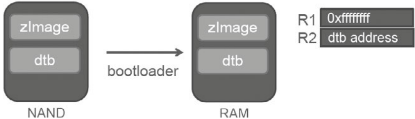
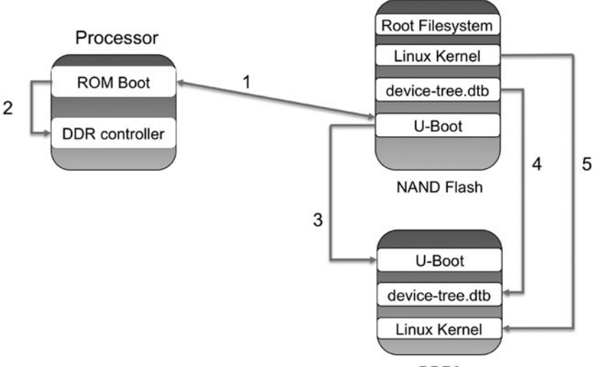
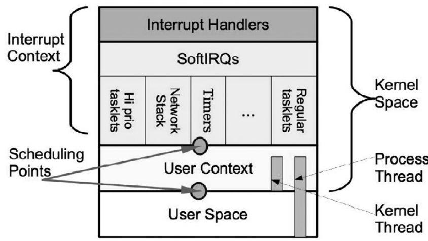
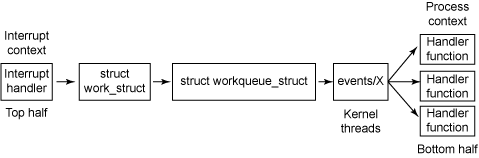

## Device Drivers

## Linux Boot process (see the boot process image)
1. Firstly the bootROM of the ARM chip gets executed on POR(power on reset) as the hardware reset logic makes ARM to start execution at bootROM.The bootROM will then based on the bootmode scans the hardware (NAND, NOR, SD/eMMC) and reads the bootstrap code(or header code) from NAND flash into internal SRAM. This bootstrap code starts initialing the DDR (RAM), also initialises hw such as clock speed etc.The bootstrap code then loads the U-boot from NAND flash to external DDR and runs it.

2. The U-Boot loads both the kernel image and the compiled device tree binary into RAM and passes the memory address of the device tree binary into the kernel as part of the launch.

3. U-Boot jumps to the kernel code.

    

4. Kernel does architecture specific low level kernel initialisation code like enabling MMU, setting up page tables, caches and finally calls non architecture code using start_kernel()

5. start_kernel() is at init/main.c, and it then initialises the following:
* initialise kernel core (memory, scheduler, interrupts)
* init built in drivers
* mount root file system based on the kernel args passed by u-boot
* initialise first user process init from /sbin/init which is the parent process of all the user processes. The init in embedded systems can be one of busy-box init, systemd or system V init etc
    

## Driver model:
Driver model is used to have some kind of abstraction so that you can have clean code or uniform code(remove code duplication).
Also with this abstraction model you can view the driver details from user space like status of the device, power states, which bus the device is attached to etc. through sysfs.

Device mode is with 3 structures:
* struct bus_type // e.g. USB, platform, PCI etc
* struct device_driver // driver capable of handling the devices on the bus
* struct device // represents a device connected to bus

..TBD
How driver init(), probe() and exit() gets called by the device model.

## _init and _exit macros
These are special sections in the linker file of kernel.
They are effective only on built-in kernel modules.

__init is effective on built in drivers as it will free the memory of the function once it is initialised. During kernel build,  the build system groups all the functions with __init in one place so that kernel can discard or free this memory once initialisation is done. Hence for loadable modules it is ineffctive as kernel has to do lot of work to delete the memory as they are not compiled during kernel build.

__exit parameter tells the kernel to omit this function when the module is built-in, since in built in modules this functions would never execute.

## Platform drivers (I2C, SPI)
Embedded SOC devices like UART, SPI, I2C, ethernet controllers etc are not hot pluggable. To handle such devices and to fit it into the device model, the platform devices are created.

How probe or init gets called of platform devices gets called.
In device tree for this device a compatible string should be defined
hellokeys {
 compatible = "arrow,hellokeys";
};

~~~
static const struct of_device_id my_of_ids[] = {
{ .compatible = "arrow,hellokeys"},
{},
}
~~~
On match the platform driver probe gets called.

## Char drivers and Network drivers

## Interrupts in drivers and Threaded IRQ
Every hardware interrupt has a number hwirq and corresponding logical number IRQ number in linux. This mapping is needed because multiple hwirq lines may be connected to the same logical IRQ number.
In linux, you can register an interrupt by using request_irq(irq_no , flags, irq_handler)
flags = IRQ_SHARED or IRQ_ONESHOT
IRQ_SHARED: used if interrupt line is shared with multiple devices
IRQF ONESHOT: The interrupt is not reenabled after the IRQ handler finishes. This flag is required for threaded irq which need to keep the interrupt line disabled until the threaded handler has run

to unregister the handler and to disable the IRQ line call
free_irq(irq_no, irq_handler).

On Linux systems any interrupt handler runs with all the interrupts disabled on the CPU actually running the handler but you definitely don't want to miss an interrupt. To meet this need, the concept of *halves* has been introduced.

***Bottom Halves***:
To service all interrupts quickly the interrupt handler is split into two halves. Top half and Bottom half.
* **Top half**: The first part is top half or hard-IRQ, which is the registered function using request_irq() and during its execution internally kernel has disabled all the IRQ's on that CPU. Essentially time sensitive tasks like read/write hardware registers, packet processing of network data etc, schedules the bottom half and then acknowledges the interrupt line so that all the interrupts will get enabled again by the kernel.
* **Bottom half**: Will process the time consuming stuff later which runs with all the interrupts enabled. Bottom half mechanisms in kernel:
a. SoftIRQ
b. tasklets
c. Work queues
d. Threaded IRQ

SoftIRQ and tasklets execute in interrupt context with hardware interrupts enabled but you cannot sleep.
Work queues and Threaded IRQ execute in process context so you are allowed to sleep.

SoftIRQs are mostly compile time declarations and do not allow dynamic task creations usign API's. Hence they are not usually used. Tasklets are used instead which allow dynamic task creations and are based on softIRQ(softirqd) daemon per CPU

*Tasklet API*:
tasklet_init()  --> called in probe or init of the driver
tasklet_schedule() --> to be called from ISR or Top Half

Work Queue:
Managed by events/X kernel threads.

At the core is the work queue (struct workqueue_struct), which is the structure onto which work is placed. Work is represented by a work_struct structure that needs to be deferred. The events/X kernel threads (one per CPU) extract work from the work queue and activates one of the bottom-half handlers (as indicated by the handler function in the struct work_struct).
You can create your own work queue or use the default global kernel work queue. When using default global kernel work queue you do not need to define the workqueue_struct.
a.) Using private work queue API:
~~~
// To create and destroy the work queue
struct workqueue_struct ∗create_workqueue( name );
void destroy_workqueue( struct workqueue_struct ∗ );
~~~
~~~
// Then define the work that you want to queue using one of
INIT_WORK( work, func );
INIT_DELAYED_WORK( work, func );
~~~
~~~
// Finally enqueue the work on work queue using one of
int queue_work( struct workqueue_struct ∗wq, struct work_struct ∗work );
int queue_work_on( int cpu, struct workqueue_struct ∗wq, struct work_struct ∗work );

int queue_delayed_work( struct workqueue_struct ∗wq,
            struct delayed_work ∗dwork, unsigned long delay );
~~~

b.) Using global kernel workqueue structure API:
~~~
// no need to define your own work queue, only define the work and queue it onto the kernel work queue
int schedule_work( struct work_struct ∗work );
int schedule_work_on( int cpu, struct work_struct ∗work );

int scheduled_delayed_work( struct delayed_work ∗dwork, unsigned long delay );
~~~

Threaded IRQ:
You can run in process context using thread IRQ api'. The threaded IRQ has higher priority than work queues. No need to schedule the thread handler function as it is done by the kernel unlike in the case of work queues where you have to schedule the work.
Not usually used.
API used is:
request_threaded_irq(irq, handler,thread_fn, irqflags, *devname, *dev_id)
handler:   represents top half.
thread_fn: is the handler function run as bottom half.

## container_of():
As the name says, the container_of macro is used to find the
container of the given field of a structure.
container_of(pointer, container_type, container_field);
*where*:
pointer: This is the pointer to the field in the structure
container_type: This is the type of structure wrapping (containing) the pointer
container_field: This is the name of the field to which pointer points inside the structure

e.g.
~~~
struct family {
struct person *father;
struct person *mother;
int number_of_sons;
int family_id;
} f;

// f has been initialised with some data
int *fam_id_ptr = &f.family_id;
struct family *fam_ptr;
/* now let us retrieve back its family */
fam_ptr = container_of(fam_id_ptr, struct family, family_id);

~~~

## Kernel sleeping mechanisms
Process needs to sleep if you are waiting for the resource or waiting for data from another process.The kernel scheduler manages a list of tasks to run, known as a run queue. Sleeping processes are not scheduled anymore, since they are removed from that run queue. Unless its state changes (that is, it wakes up), a sleeping process will never be executed.
For this kernel has the concept of wait queue:
*Wait Queue*:
Wait queues are essentially used for blocked I/O, to wait for particular conditions to be true, and to sense data or resource availability.
~~~
struct __wait_queue {
unsigned int flags;
wait_queue_func_t func;
struct list_head task_list; // every process that you want to put to sleep uses this list (hence the name wait queue)
};
~~~

API:
wait_event_interruptible() to block
wake_up_interruptible() to unblock

## Timers (jiffies)
One way to defer the work in the kernel is with timers (other is bottom halves)
Two timers exist in kernel
1. Absolute time using hardware chip RTC
2. Relative time used by scheduler called as kernel timer.

Relative times (kernel timer) is again of 2 types
a. System timer is based on jiffies
b. HRT (high resolution timer)

*jiffie* is a variable incremented by 1 everytime due to timer expiry (hardware timer interrupt).
This increment is called tick.
If HZ = 100, means jiffie gets incremented HZ times every second.

There are timer API's timer_init(), mod_timer(callback function),delete_timer() etc which calls a callback function after the expiry of the timer.

*HRT* are used for real time applications as they are very accurate. They have resolution in micro or nano seconds. They depend on hardware being used. HRT is based on ktime and not on jiffies. HRT has its own API's which must be used to use them.

***Tickless or dynamic tick***:
When no task is running Scheduler will run the idle thread. In idle thread the system tick timer is disabled. This is called tickless or dynamic tick. This helps save CPU power.
How it reenables the system tick:
kernel knows the task timeout or the next timer expiry. It will reenable the system ticks after the task timeout or expiry of the timer so that scheduler can be invoked again.

Since you are disabling and enabling system ticks it is called tickless.

## Delays
You can delay execution in atomic or non atomic context.
In atomic or ISR context you cannot sleep. Below function do busy looping and hence can be used in atomic context.
API'S used are
ndelay()
mdelay()
udelay()
Even timer callbacks are executed in atomic contexts.
Sleeping functions like mutex lock() or kmalloc() or sleep() functions are not allowed in atomic contexts.

In process or non-atomic contexts the following apis are used:
usleep() is based on HRT timers for very small usecs delay
msleep() is based on jiffies

## Kernel locking mechanisms
*Race Condition*:
A race condition occurs when two or more threads can access shared data and they try to change it at the same time. Because the thread scheduling algorithm can swap between threads at any time, you don't know the order in which the threads will attempt to access the shared data. Therefore, the result of the change in data is dependent on the thread scheduling algorithm, i.e. both threads are "racing" to access/change the data.

Locking needed to avoid the race consition. i.e. when two processes or threads or kernel threads need to access the same device (e.g GPIO) or shared data etc to prevent corruption or concurrent access of the data.
example: one process tries to write and one tries to read at the same time in the critical section leading to corruption or race condition.

1. **Spinlock**
Used in multicore or SMP systems.In spinlock you keep wasting the CPU cycles using busy looping. Spinlocks are used in Interrupts where sleeping is not allowed.
Does not make sense having spinlocks in single core systems as then if the thread aquires the lock then there is no chance to unlock it due to busy loop, until you disable preemption. Spinlocks acquired by the kernel may be implemented by turning off preemption, because this ensures that the kernel will complete its critical section without another process interfering. The entire point is that another process waiting for the lock will not be able to run until the kernel releases the lock.
On multicore systems, if one core acquires spinlock it will disable spinlock only on this core and not on spinlock waiters.

Note: If you keep preemption enabled in spinlocks, then if process A holding the lock is scheduled out and starts process B which also tries to acquire the lock and starts spinning just wasting CPU cycles thus making it very inefficient.
***Advantages***:
* It is efficient than mutex as there is no latency associated like rescheduling and you disable preemption in spinlock. Spinlock is designed for efficiency and suited for small & fast critical sections.
* Easy to implement
***Disadvantages***:
* Only suited for interrupts or contexts like timer callbacks where sleeping is not allowed.
* As spinlocks infinitely spin in a loop(consuming CPU), you can't hold spinlocks for a long time, since waiters will waste CPU time waiting for the lock, whereas a mutex can be held as long as the resource needs to be protected, since contenders are put to sleep in a wait queue

**Implementing spinlocks**:
An easy way to implement spinlock is using test and set instruction and is CPU dependent on how it is internally implemented
~~~
uint32 test_lock(uint32 *memory_location, uint32 old_value,  int32 new_value) {
    atomically {
        if (*memory_location == old_value)
            *memory_location = new_value;
        return old_value;
    }
}

uint32 mylock = 0;
while (test_lock(&mylock, 0, 1) != 0) //If thread A takes the lock then thread B keeps busy looping
    ;
~~~

## Sharing Spinlocks between Interrupt and Process Context
It is possible that a critical section needs to be protected by the same lock in both an interrupt and in non-interrupt (process) execution context in the kernel. In this case spin_lock_irqsave() and the spin_unlock_irqrestore() variants have to be used to protect the critical section. This has the effect of disabling interrupts on the executing CPU. You can see in the steps below what could happen if you just used spin_lock() in the process context:
1. Process context kernel code acquires the spinlock using spin_lock.
2. While the spinlock is held, an interrupt comes in on the same CPU and executes.
3. Interrupt Service Routing (ISR) tries to acquire the spinlock, and spins continuously waiting for it. Process context is blocked in the CPU and there is never a chance to run again and free the spinlock.

To prevent this, the process context code needs call spin_lock_irqsave, which has the effect of disabling interrupts on that particular CPU along with the regular disabling of preemption on the executing CPU.

2. **Mutex**

Mutex is used in process context and not in interrupt context as the process holding the mutex is allowed to sleep. If a process A acquires a mutex lock and enters the critical section and is scheduled out due to preemption and if another process B tries to acquire the same mutex then it is put to sleep. i.e. the process B is moved out of run queue and pushed to wait queue. As soon as the mutex is available again then process B is moved back from wait queue back to run queue.
***Advantages***:
* As process is allowed to sleep, it does not waste CPU cycles and you can hold mutexes for a long time.

***Disadvantages***:
* As preemtion is enabled and the process can be scheduled out, it is inefficient as it involves lot of latency.
* Cannot be used in ISR (interrupt) context as you cannot sleep in interrupts. You cannot sleep in interrupts because interrupts are asnchronous and cannot be scheduled by anyone or the scheduler.

**Implementing Mutex**:
Mutex internally uses spinlock + adds wait queue to it.
~~~
struct mutex {
/* 1: unlocked, 0: locked, negative: locked, possible waiters */
atomic_t count;
spinlock_t wait_lock;
struct list_head wait_list;
[...]
};
Contenders are removed from the scheduler run queue and put onto the wait list (wait_list) in a sleep state. The kernel then schedules and executes other tasks. When the
lock is released, a waiter in the wait queue is woken, moved off the wait_list, and scheduled back.

~~~

## Semaphores vs Mutex
Semaphores are usually used when there are multiple resources of the same type as counting objects. Here it is called counting semaphores.
e.g. say we have 2 or more network sockets.
semaphore count will be 2.
If Task A acquires one socket count = 1
If Task B acquires one socket count = 2
If another Task C tries to get the socket, it will be blocked until one of the Tasks A or B releases the semaphore.

There are three tasks that need access. A counting semaphore is used to limit the number of simultaneous socket connections. Each time a task is finished with the shared resource (that is, its socket closes), it must give back its semaphore so another task can gain access to the network.

Semaphores can be used to signal the tasks from ISR i.e. for signalling from ISR.

Binary semaphores are really just counting semaphores with a maximum count of 1. They are most often used for  synchronization. When a task needs to synchronize on an event, it will attempt to take a semaphore, blocking or sleeping until the semaphore becomes available or there is a timeout.

Mutex is like binary semaphore but has the property of minimizing priority inversion (read priority inversion)

## Device Tree
A data structure for defining the hardware so that this information of the hardware can be passed to the kernel.The kernel does not need to hardcode details of the hardware.
.dtsi are include files which describe hardware that is common across multiple platforms.
.dts are source files that describe hardware specific to one platform.

3 major purposes DT is used:
1. Platform Identification.
 compatible string is used to define the platform
 In dtsi file:
 compatible = "atmel,sama5d2";

In the kernel machine specific code
~~~
static const char *const sama5_alt_dt_board_compat[] __initconst = {
"atmel,sama5d2",
"atmel,sama5d4",
NULL
};
DT_MACHINE_START(sama5_alt_dt, "Atmel SAMA5")
/* Maintainer: Atmel */
.init_machine = sama5_dt_device_init,
.dt_compat = sama5_alt_dt_board_compat, // DT compatible
.l2c_aux_mask = ~0UL,
~~~

2. Runtime configuration
This includes kernel boot args and start of Root file system
~~~
chosen
 {
 bootargs = "console=ttyS0,115200 loglevel=8";
 initrd-start = <0xc8000000>;
 initrd-end = <0xc8200000>;
};
~~~
3. Device specific configuration such as I2C, SPI, USB etc

## Cache thrashing

## DMA in drivers and Cache coherency problem
DMA introduces the cache coherency problem, where the main memory is out of sync with the cache in multicore systems or devices on the System on Chip.
e.g.
Lets assume a CPU with device controller (say SPI or I2C or CSI controller with internal hw buffer). There is a cache memory and main memory (RAM).

***Case 1***
If CPU writes new data to the location X which was already cached.The update happens only in cache and not to the main memory if it is a write back cache policy. If you now initiate a DMA transfer from location X in main memory to the device hw buffer then you use old or stale data at location X during DMA transfer. This can be solved using cache flush or cache clean, where you write back data from cache to main memory.

***Case 2***
If DMA transfers new data from hw buffer to memory at location X and if X was already cached, then the CPU will still read the old stale data in cache from location X.This is where you must invalidate the cache line (mark the cache content as invalid) so that you discard the old cache  contents completely and CPU will now have to re-read new data from the memory at location X into cache.

Summary:
A ***cache invalidate*** simply marks the cache contents as invalid. So the next time you access data, you will get what is in the main memory.

A ***cache flush*** writes back data from cache into memory.

Cache coherency problem solution is architecture specific.
In coherent systems, CPU uses bus snooping hardware (bus snooping protocol) where when you initiate DMA with the main memory the hardware itself does cache flush/invalidate the memory.Hence hardware takes care of cache coherency problem.

In non-coherent systems, device driver itself should flush/invalidate the data cache during DMA transfers.

DMA steps in linux:
• Allocate a DMA slave channel
• Set slave and controller specific parameters
• Get a descriptor for transaction
• Submit the transaction
• Issue pending requests and wait for callback notification

In case if IOMMU(it is called SMMU in case of ARM) is used then there is the concept of bus address for DMA.
In absence of IOMMU bus address  = physical address

e.g. In Raspi there is no IOMMU hence physical address is used for DMA.

In x86 platforms or in ARM cortex a53 have IOMMU.

IOMMU is similar to MMU, but this is used for IO devices on the SOC which are connected to the CPU.

What is DMA mapping:
It means allocating DMA buffer and generating bus address(IOMMU)/physical address(non IOMMU) for it. Devices use bus/physical address based on if IOMMU is used or not.

DMA mapping types:
1. Coherent mapping
2. Streaming mapping

**Coherent mapping**:
This does both : allocates memory and also does mapping of this buffer i.e. produce corresponding bus address
The dma_alloc_coherent() function allocates uncached, unbuffered memory for a device for performing DMA. It  allocates pages, returns the CPU-viewed (virtual) address, and sets the third argument to the device-viewed address.
Memory allocated is physically contiguous. Automatically manages cache cohereny problems but is too costly as it has to allocate memory and then flush/invalidate
API:
dma_alloc_coherent()
dma_free_coherent()

**Streaming mapping**:
This only does the mapping for the already allocated buffers in the drivers. Does not automatically perform cache coherency problems.
Also useful if the buffers are scattered and non-contiguous.
1. Single page mapping (maps single buffer)
2. Scatter gather mapping (maps several scattered buffers)

API:
dma_map_single()
dma_unmap_single()
dma_map_sg()
