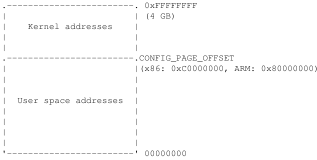
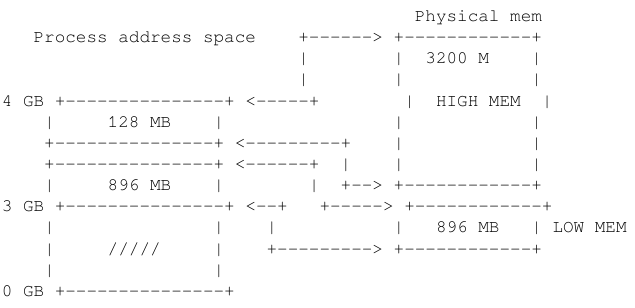
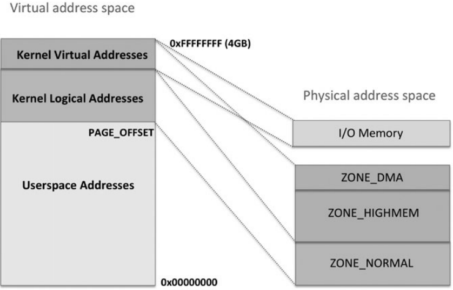

## Kernel Memory Management
Linux user and kernel space use virtual memory which is then converted to physical memory using MMU hardware.

## Page fault exception
When a process tries to access memory in a page that is not known to the MMU, the MMU generates a *page fault exception*. The page fault exception handler examines the state of the MMU hardware and the currently running process’s memory information, and determines whether the fault is a "good" one, or a "bad" one. Good page faults cause the handler to give more memory to the process; bad faults cause the handler to terminate the process.

Good page fault: When the process tries to allocate new dynamic memory or increase in stack size, the MMU declares a page fault and MMU adds the new page in the Translation table.

Bad page fault: can occur due to
* When a process follows a NULL pointer, or tries to access memory that it doesn’town.
* Bugs in the kernel, in which case the handler will print an "oops" message before terminating the process.

## Translation Lookaside buffer (TLB)
TLBs behave as caches of the translation table information.
The Translation Lookaside Buffer (TLB) is a cache of page translations within the MMU. During memory access, the MMU first checks whether the translation is cached in the TLB.
*TLB hit*:
If the requested translation is available, we have a TLB hit, and the TLB provides the translation of the physical address immediately.
*TLB miss*:
If the TLB does not have a valid translation for that address, we have a TLB miss and an external page table walk is required. This newly loaded translation can then be cached in the TLB for possible reuse.

## Virtual memory layout kernel

Page = Virtual page = Memory Page is the virtual page of 4K size on ARM and x86

Page Frame = Frame is the physical page of 4K size
PFN (page frame number) is the number given to every Page Frame or Frame

Macros available: page_to_pfn() and pfn_to_page()
Page Table is a kernel data structure mapping between virtual and physical addresses.

#### Kernel low and High memory

*Kernel low memory*:
First 896 MB of kernel address is low memory which is mapped permanently by the kernel during early boot. This is also called kernel logical address. The logical address which are kernel virtual address can be translated to a physical address by subtracting a fixed offset as the mapping is permanent. This memory cannot be swapped out.
E.g. kmalloc() gives memory from this region. They are both physically and virtually contiguous.

*Kernel high memory*:
The top 128 MB of 1GB kernel memory is high memory. This memory is created on the fly by the kernel and is temporary.i.e. it will be destroyed by the kernel after its use.The physical memory above 896MB is mapped to the 128MB of the kernel virtual address space.
e.g. vmalloc() or ioremap() gives virtually contiguous memory but not physically.

The figures show kernel mapping layout:
Fig 1:

Fig 2:

#### Different physical memory zones:
ZONE_DMA: mapped to the kernel virtual address space(HIGHMEM) e.g. dma_alloc_xxx() functions

ZONE_NORMAL: mapped to kernel logical address space. Used for kernel data structures, kmalloc() etc

ZONE_HIGH: mapped to kernel virtual address space (HIGHMEM) e.g. vamlloc()

Memory Mapped IO:mapped to kernel virtual address space (HIGHMEM) e.g. ioremap() function.

## Virtual memory layout User Space
Each process is given a table of memory mapping described by mm_struct.Process which is represented by task_struct contains mm_struct *mm.
Unlike kernel mapping which happens at boot time and is constantly present and maps the same physical memory in every process,the mapping of user mode portion of the process changes after every context switch.

User space virtual memory layout contains 4 logical areas:

1. Text or code segment
2. Data segment (BSS + data + heap)
   data stores static initialised variables
   BSS stores static uninitialised variables
   heap for malloc()
3. Memory mapping segment: E.g. process can do a memory mapping using mmap().
4. Stack segment: Mostly for local variables

mm_struct contains the pointers or variables pointing to the above segments.

## Kernel Memory Allocators

