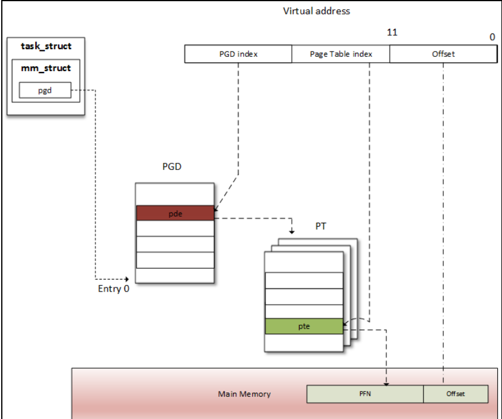
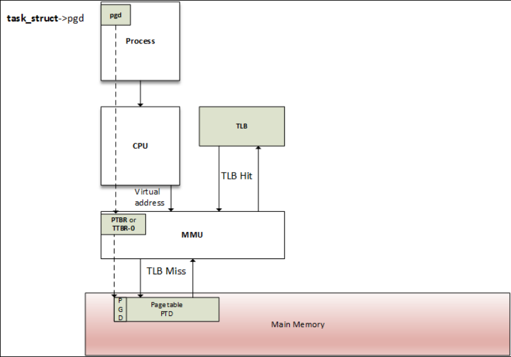
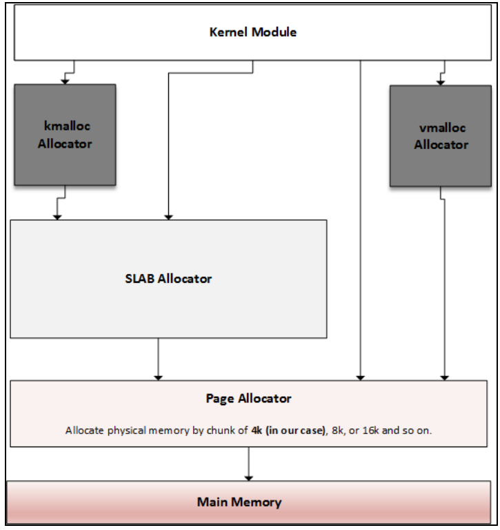
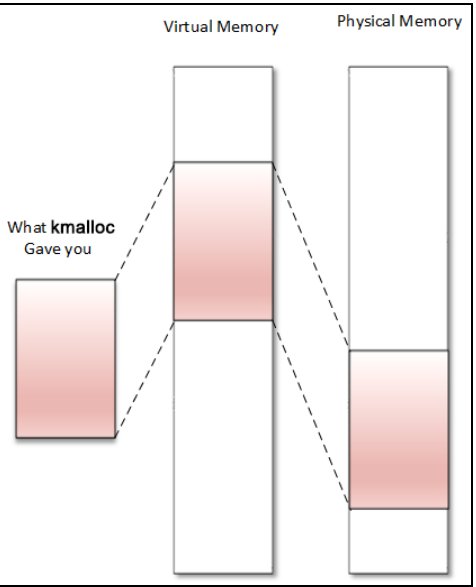
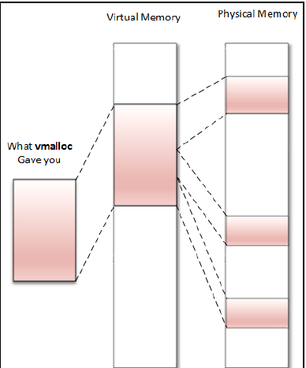

## Kernel Memory Management
Linux user and kernel space use virtual memory which is then converted to physical memory using MMU hardware.

## Virtual memory layout kernel

Page = Virtual page = Memory Page is the virtual page of 4K size on ARM and x86

Page Frame = Frame is the physical page of 4K size
PFN (page frame number) is the number given to every Page Frame or Frame or physcial page

Macros available: page_to_pfn() and pfn_to_page()
Page Table is a kernel data structure mapping between virtual and physical addresses.

## Page Tables
The concept of the page table is introduced to manage mapping between pages and frames. Pages are spread over tables, so that each PTE corresponds to a mapping between a page and a frame. Each process is then given a set of page tables to describe its whole memory space.

### Why multilevel page table is used:
Most architecture requires 32 bits (4 bytes) to represent a PTE. Each process has its private 3 GB user space address, so we need 786,432 entries to characterize and cover a process address space. It represents too much physical
memory spent per process, just to characterize the memory mappings. To solve this multi level page table is used. The space necessary to store a multilevel page table only depends on the virtual address space actually in use, instead of being proportional to the maximum size of the virtual address space. This way, unused memory is no longer represented.

Linux has support uptoi 4 level page table, however in ARM 32 bit platforms only 2 levels are sufficient which uses PGD and PTE
Four level paging model has:
a.) PGD (page global directory)
b.) PUD ->ignored
c.) PMD ->ignored
d.) PTE (page table entry)

In ARM, **TTBR0** stores the PGD(level 1) of the user process.
pgd field of struct mm_struct points:
current->mm.pgd == TTBR0.

**TTBR1** stores the PGD(level1) of the kernel.
During context switch only TTBR0 will change as kernel space is always fixed mapped during boot.

At context switch (when a new process is scheduled and given the CPU), the kernel immediately configures the MMU and updates the TTBR0 with the new process's pgd.

## Page fault exception
When a process tries to access memory in a page table that is not known to the MMU, the MMU generates a *page fault exception* ie (process accessed an unmapped area of its virtual memory). The page fault exception handler examines the state of the MMU hardware and the currently running process’s memory information, and determines whether the fault is a "good" one, or a "bad" one. Good page faults cause the handler to give more memory to the process; bad faults cause the handler to terminate the process.

**Good Page Fault**: When the process tries to allocate new dynamic memory or increase in stack size, the MMU declares a page fault and MMU adds the new page in the Translation table (Page table).

**Bad Page Fault**: can occur due to
* When a process follows a NULL pointer, or tries to access memory that it doesn’town.
* Bugs in the kernel, in which case the handler will print an "oops" message before terminating the process.

If there is a valid page table entry at that offset, the processor takes the PFN(physical page) from this entry.

## Translation Lookaside buffer (TLB)
To improve performance of accessing the page tables (translation tables) TLB is used. TLB's behave as caches of the translation table (page table) information.The Translation Lookaside Buffer (TLB) is a cache of page translations within the MMU. During memory access, the MMU first checks whether the translation is cached in the TLB.
*TLB hit*:
If the requested translation is available, we have a TLB hit, and the TLB provides the translation of the physical address immediately.
*TLB miss*:
If the TLB does not have a valid translation for that address, we have a TLB miss and an external page table walk is required. This newly loaded translation can then be cached in the TLB for possible reuse.

TLB miss is handled by software or hardware:
**@software handling**: The handler tries to go through the external process page table to find the PTE. If found then it brings the new translation page into the TLB. If still not found in the external page table then page fault exception handler is called as described above.

**@hardware handling**: Hardware MMU itself tries to do what is done by the software

#### Kernel low and High memory

*Kernel low memory*:
First 896 MB of kernel address is low memory which is mapped permanently by the kernel during early boot. This is also called kernel logical address. The logical address which are kernel virtual address can be translated to a physical address by subtracting a fixed offset as the mapping is permanent. This memory cannot be swapped out.
E.g. kmalloc() gives memory from this region. They are both physically and virtually contiguous.

*Kernel high memory*:
The top 128 MB of 1GB kernel memory is high memory. This memory is created on the fly by the kernel and is temporary.i.e. it will be destroyed by the kernel after its use.The physical memory above 896MB is mapped to the 128MB of the kernel virtual address space.
e.g. vmalloc() or ioremap() gives virtually contiguous memory but not physically.

The figures show kernel mapping layout:
Fig 1:

Fig 2:

#### Different physical memory zones:
ZONE_DMA: mapped to the kernel virtual address space(HIGHMEM) e.g. dma_alloc_xxx() functions

ZONE_NORMAL: mapped to kernel logical address space. Used for kernel data structures, kmalloc() etc

ZONE_HIGH: mapped to kernel virtual address space (HIGHMEM) e.g. vamlloc()

Memory Mapped IO:mapped to kernel virtual address space (HIGHMEM) e.g. ioremap() function.

## Virtual memory layout User Space
Each process is given a table of memory mapping described by mm_struct.Process which is represented by task_struct contains mm_struct *mm.
Unlike kernel mapping which happens at boot time and is constantly present and maps the same physical memory in every process,the mapping of user mode portion of the process changes after every context switch.

User space virtual memory layout contains 4 logical areas:

1. Text or code segment
2. Data segment (BSS + data + heap)
   data stores static initialised variables
   BSS stores static uninitialised variables
   heap for malloc()
3. Memory mapping segment: E.g. process can do a memory mapping using mmap() e.g. mapping a file into process memory
4. Stack segment: Mostly for local variables

mm_struct contains the pointers or variables pointing to the above segments.

## Kernel Memory Allocators

Page Allocator uses buddy algorithm for memory allocation which allocates pages in 2^n (n = 0, 1, 2 etc) i.e 1, 2, 4, 8, 16...number of physical pages

In linux SLAB allocator is of 3 different implementations:
SLAB, SLUB and SLOB (mostly SLUB is used)

**kmalloc()**
Gives contiguous virtual memory which is also physically contiguous.

kmalloc() depends on slab allocator
void *kmalloc(size_t size, int flags);
flags:
GFP_KERNEL: This is the standard flag. We cannot use this flag in the interrupt handler because its code may sleep. It always returns memory from the LOM_MEM zone (hence a logical address).
GFP_ATOMIC: This guarantees the atomicity(non blocking) of the  allocation. The only flag to use when we are in the interrupt context. Please do not abuse this, since it uses an emergence pool of memory.
GFP_USER: This allocates memory to a user space process. Memory is then distinct and separated from that allocated to the kernel.
GFP_HIGHUSER: This allocates memory from the HIGH_MEMORY zone.
GFP_DMA: This allocates memory from DMA_ZONE.

To free the memory use kfree()

**vmalloc()**
Gives only virtually contiguous memory but not physically contiguous.

The returned memory always comes from the HIGH_MEM zone and cannot be used for DMA as it is not physically contiguous.
vmalloc not much used in real life use cases in kernel.

**Memory Mapped IO**
Mapping the device registers as memory so that you then read/write on the mapped memory.

In other words if I need to access for say the 4 MB of memory-mapped space assigned to IPU-2 (from 0x02A00000 to 0x02DFFFFF) of the i.MX6, the CPU (by means of the MMU) may assign me address range 0x10000000 to 0x10400000, which is virtual of course. This is not consuming physical RAM (except for building and storing page table entries), but just address space, meaning that the kernel will no longer use this virtual memory range to map RAM(mapping is part of HIGH_MEM actually) . Now any writing/reading operation at this address range ( let's say 0x10000004, for example) will be redirected to the IPU-2 device.

__ioremap() is used for this purpose.
After mapping use
ioread()
iowrite()

## Mapping kernel memory to user space
Since user space is unpriviledged you cannot access kernel memory (physical memory) in user processes. To avoid copying kernel memory to user space which is very inefficient, you need to use mmap() system call which internally uses
remap_pfn_range():
maps physical memory (by means of kernel logical address) to a user space process. It is particularly useful for implementing the mmap() system call.
or
ioremap_pfn_range():
For mapping I/O memory to user space

what kernel internally does with mmap:
Since user space code cannot access kernel memory, the purpose of the mmap() function is to derive one or more protected kernel page table entries (which correspond to the memory to be mapped) and duplicate the user space page tables, remove the kernel flag protection,and set permission flags that will allow the user to access the same memory as the kernel without needing special privileges.

Your driver needs to have its own mmap() if you want the driver buffer to be accessible to the user space. E.g. you have read and write buffer in the kernel driver and you want these buffers to be accessed in user space then add your version of mmap() in your driver.